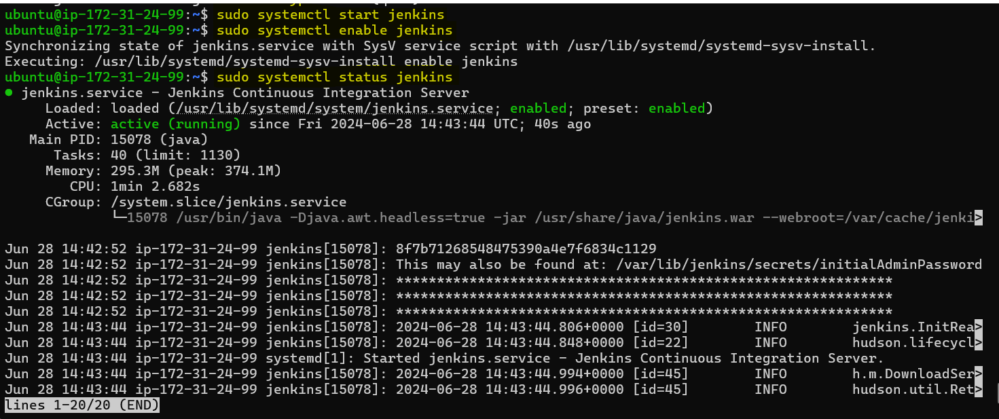
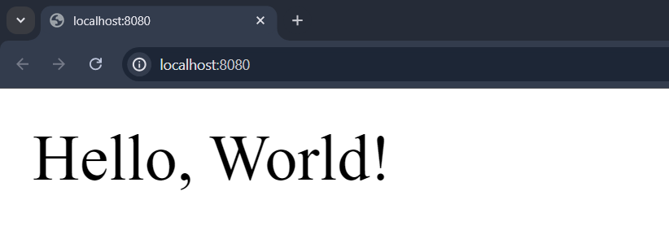

# Automating Docker Image Builds and Pushes to Docker Hub using Jenkins on AWS EC2

## Overview

In this guide, we will walk through the process of setting up a CI/CD pipeline using Jenkins to build Docker images from a Node.js application and push them to Docker Hub. The pipeline will be set up on an AWS EC2 instance running Ubuntu, ensuring an automated, streamlined approach to deploying applications. By the end of this tutorial, you will have a fully functioning Jenkins server capable of building Docker images and pushing them to your Docker Hub repository upon each commit to your GitHub repository.

## Prerequisites

- AWS account
- Basic knowledge of AWS EC2, Jenkins, Docker, and Git
- GitHub account
- Docker Hub account

## Step 1: Set Up AWS EC2 Instance

1. **Launch EC2 Instance**:
   - Log in to your AWS Management Console.
   - Navigate to the EC2 Dashboard and click on "Launch Instance".
   - Choose an Amazon Machine Image (AMI). For Jenkins, a standard Ubuntu Server (e.g., Ubuntu Server 20.04 LTS) is a good choice.
   - Select an instance type (e.g., t2.micro for free tier eligibility).
   - Configure instance details as needed.
   - Add storage (the default 8 GB should suffice).
   - Add a tag (optional).
   - Configure security groups: add rules to allow SSH (port 22) and Jenkins (port 8080) access.
   - Review and launch the instance, selecting an existing key pair or creating a new one.

2. **Connect to Your EC2 Instance**:

   Use SSH to connect to your EC2 instance:
    
     ```bash
     ssh -i /path/to/your-key-pair.pem ubuntu@your-ec2-public-dns
     ```

## Step 2: Install Jenkins on EC2

1. **Update the Package Manager**:

   Run the following command to update the package manager:

   ```bash
   sudo apt update
   sudo apt upgrade -y
   ```

2. **Install Java (required for Jenkins)**:
   
   ```bash
   sudo apt install openjdk-11-jdk -y
   ```

3. **Add Jenkins Repository and Install Jenkins**:

    ```bash
    # Download the Jenkins key and add it to the trusted key list
    wget -q -O - https://pkg.jenkins.io/debian/jenkins.io-2023.key | sudo tee /etc/apt/trusted.gpg.d/jenkins.asc

    # Add the Jenkins repository to the sources list
    sudo sh -c 'echo deb http://pkg.jenkins.io/debian-stable binary/ > /etc/apt/sources.list.d/jenkins.list'

    # Update the package list
    sudo apt update

    # Install Jenkins
    sudo apt install jenkins -y
    ```

4. **Start and Enable Jenkins**:
   
   ```bash
   sudo systemctl start jenkins
   sudo systemctl enable jenkins
   ```

   Check the status of the jenkins using:

   ```bash
   sudo systemctl status jenkins
   ```

   

## Step 3: Install Docker on EC2

Run the following command to update the package manager:

```
sudo apt update
sudo apt install vim -y
```
### Save this install.sh 

```bash
#!/bin/bash

# Update package database
#!/bin/bash

# Update package database
echo "Updating package database..."
sudo apt update

# Upgrade existing packages
echo "Upgrading existing packages..."
sudo apt upgrade -y

# Install required packages
echo "Installing required packages..."
sudo apt install -y apt-transport-https ca-certificates curl software-properties-common

# Add Docker’s official GPG key
echo "Adding Docker’s GPG key..."
curl -fsSL https://download.docker.com/linux/ubuntu/gpg | sudo gpg --dearmor -o /usr/share/keyrings/docker-archive-keyring.gpg

# Add Docker APT repository
echo "Adding Docker APT repository..."
echo "deb [arch=amd64 signed-by=/usr/share/keyrings/docker-archive-keyring.gpg] https://download.docker.com/linux/ubuntu $(lsb_release -cs) stable" | sudo tee /etc/apt/sources.list.d/docker.list > /dev/null

# Update package database with Docker packages
echo "Updating package database with Docker packages..."
sudo apt update

# Install Docker
echo "Installing Docker..."
sudo apt install -y docker-ce

# Start Docker manually in the background
echo "Starting Docker manually in the background..."
sudo dockerd > /dev/null 2>&1 &

# Add current user to Docker group
echo "Adding current user to Docker group..."
sudo usermod -aG docker ${USER}

# Apply group changes
echo "Applying group changes..."
newgrp docker

# Set Docker socket permissions
echo "Setting Docker socket permissions..."
sudo chmod 666 /var/run/docker.sock

# Print Docker version
echo "Verifying Docker installation..."
docker --version

# Run hello-world container in the background
echo "Running hello-world container in the background..."
docker run -d hello-world

echo "Docker installation completed successfully."
echo "If you still encounter issues, please try logging out and logging back in."

```

```bash
chmod +x install.sh
```

```bash
./install.sh
```

Open new terminal to use docker without root permission,or use in terminal 1 with root permission.

**Add Jenkins User to Docker Group**:

```bash
sudo usermod -aG docker jenkins
sudo systemctl restart jenkins
```
   

## Step 4: Open Jenkins in a Web Browser

   - Retrieve the initial admin password:

     ```bash
     sudo cat /var/lib/jenkins/secrets/initialAdminPassword
     ```

   - Open your browser and navigate to `http://your-ec2-public-dns:8080`.
   - Enter the initial admin password.
   - Follow the setup wizard to complete the installation (install suggested plugins, create an admin user, etc.).
   - **Install Docker Pipeline Plugin (if not installed)**:

     If you do not find the Docker Pipeline plugin in the list, switch to the `Available` tab.
     Search for `Docker Pipeline`. Check the box next to `Docker Pipeline` and click `Install without restart` or `Install and restart` if you prefer.


## Step 5: Create Node.js Application

1. **Create `app.js`**:
   ```javascript
   // app.js

   const express = require('express');
   const app = express();
   const port = 8080;

   app.get('/', (req, res) => {
     res.send('Hello, World!');
   });

   app.listen(port, () => {
     console.log(`App listening at http://localhost:${port}`);
   });
   ```

2. **Create `package.json`**:
   ```json
   {
     "name": "simple-node-app",
     "version": "1.0.0",
     "description": "A simple Node.js app",
     "main": "app.js",
     "scripts": {
       "start": "node app.js"
     },
     "author": "Your Name",
     "license": "ISC",
     "dependencies": {
       "express": "^4.17.1"
     }
   }
   ```

   Use `npm install` to install all the dependencies and run `npm start` to start the nodejs application.
   
   

3. **Create `Dockerfile`**:
   ```Dockerfile
   FROM node:14

   WORKDIR /usr/src/app

   COPY package*.json ./

   RUN npm install

   COPY . .

   EXPOSE 8080

   CMD ["node", "app.js"]
   ```

## Step 6: Push Code to Git Repository

1. **Initialize Git Repository**:
   ```bash
   git init
   ```

2. **Add Files and Commit**:
   ```bash
   git add .
   git commit -m "Initial commit"
   ```

3. **Create a Repository on GitHub**:
   - Go to GitHub and create a new repository.

4. **Add Remote and Push**:

   ```bash
   git remote add origin https://github.com/your-username/your-repo.git
   git push -u origin main
   ```

## Step 7: Configure Jenkins Pipeline

1. **Open Jenkins Dashboard**:
   - Navigate to `http://your-ec2-public-dns:8080`.

2. **Add Docker Hub Credentials to Jenkins**:
   - Go to `Manage Jenkins` -> `Credentials` -> `(global)` -> `Add Credentials`.
   - Select `Kind` as `Username with password`.
   - Enter your Docker Hub username and password.
   - Optionally, provide an ID for these credentials (e.g., `docker-hub-credentials`).

3. **Create a New Pipeline Job**:
   - Click on `New Item`.
   - Enter a name for your job, select `Pipeline`, and click `OK`.

4. **Define the Pipeline Script**:
   - Go to the job configuration page by clicking on the job name and then `Configure`.
   - In the `General` section, select `Github Project` and give the url of the project repository.
   - Select `GitHub hook trigger for GITScm polling` from `Build Triggers`.
   - In the `Pipeline` section, select `Pipeline script`.
   - For getting the pipeline syntax for `checkout` and `withCredentials` select `Pipeline Syntax` and get the syntax by filling up the necessary information.
   - You don't need to add credentails if you are using a public git repository.
   - Enter the following Groovy script with the syntax you generated:

```groovy
pipeline {
    agent any
    
    environment {
        DOCKER_HUB_REPO = 'ahnafnabil/jenkins-demo-nabil'
        DOCKER_HUB_CREDENTIALS_ID = 'docker-hub-credentials'
    }

    stages {
        stage('Checkout') {
            steps {
                checkout scmGit(branches: [[name: '*/main']], extensions: [], userRemoteConfigs: [[url: 'https://github.com/AhnafNabil/Jenkins-Test-Demo.git']])
            }
        }

        stage('Build Docker Image') {
            steps {
                script {
                    def customImage = docker.build("my-app:${env.BUILD_NUMBER}")
                    customImage.inside {
                        sh 'echo "Docker image built successfully"'
                    }
                }
            }
        }

        stage('Login to Docker Hub') {
            steps {
                script {
                    withCredentials([usernamePassword(credentialsId: 'docker-hub-credentials', passwordVariable: 'DOCKER_HUB_PASSWORD', usernameVariable: 'DOCKER_HUB_USERNAME')]) {
                        sh 'echo $DOCKER_HUB_PASSWORD | docker login -u $DOCKER_HUB_USERNAME --password-stdin'
                    }
                }
            }
        }

        stage('Tag and Push Docker Image') {
            steps {
                script {
                    def imageTag = "${env.DOCKER_HUB_REPO}:latest"
                    def imageTagBuildNumber = "${env.DOCKER_HUB_REPO}:${env.BUILD_NUMBER}"
                    sh "docker tag my-app:${env.BUILD_NUMBER} ${imageTag}"
                    sh "docker tag my-app:${env.BUILD_NUMBER} ${imageTagBuildNumber}"
                    
                    withCredentials([usernamePassword(credentialsId: 'docker-hub-credentials', usernameVariable: 'DOCKER_HUB_USERNAME', passwordVariable: 'DOCKER_HUB_PASSWORD')]) {
                        sh "docker push ${imageTag}"
                        sh "docker push ${imageTagBuildNumber}"
                    }
                }
            }
        }
    }
    
    post {
        always {
            sh "docker rmi my-app:${env.BUILD_NUMBER} || true"
            sh "docker rmi ${env.DOCKER_HUB_REPO}:latest || true"
            sh "docker rmi ${env.DOCKER_HUB_REPO}:${env.BUILD_NUMBER} || true"
        }
    }
}
```

## Step 8: Verify Jenkins Pipeline Execution

1. **Save the Job Configuration**:
   - After entering the pipeline script, click `Save`.

2. **Build the Pipeline**:
   - On the job page, click `Build Now` to run the pipeline.
   - Monitor the build progress and check for any errors.

3. **Check Jenkins Console Output**:
   - Click on the build number and then `Console Output`.
   - Ensure each stage completes successfully without errors.

## Step 9: Verification of Docker Image on Docker Hub

1. **Log In to Docker Hub**:
   - Open a web browser and go to [Docker Hub](https://hub.docker.com/).
   - Log in with your Docker Hub credentials.

2. **Navigate to Your Repository**:
   - In your Docker Hub dashboard, go to the repository specified in your Jenkins pipeline (`your-dockerhub-username/your-repo`).
   - Verify that the new image with the correct tag(s) (`latest` and `BUILD_NUMBER`) is present.

By following these steps, you will successfully set up Jenkins on an AWS EC2 instance, build a Docker image for a Node.js application, and push it to Docker Hub automatically.